# Library Management System REST API:

This is a lightweight API written in Flask and a SQLite3 database
Through this API, following are the routes/endpoints and the things you can do with them.

### 1. Search book name (/libapi/books/search_book/<book_name>)
If book exists, the output will be shown as the following example.
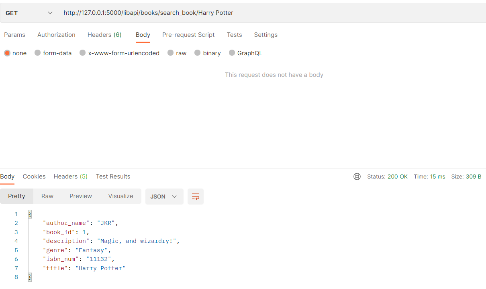

### 2. Add book (/libapi/books/add_book)
Onboard new books, book_id will be autoassigned.
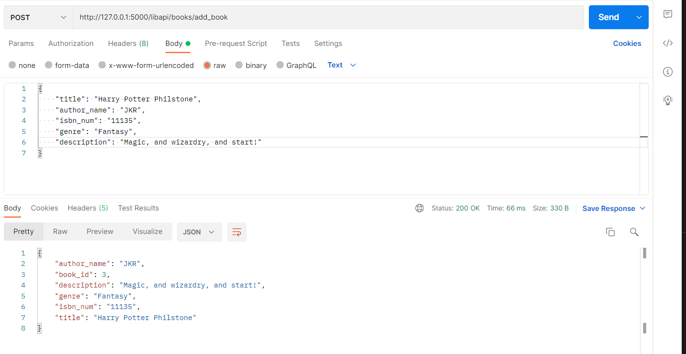

### 3. Add library (/libapi/library/add_library)
Add new libraries
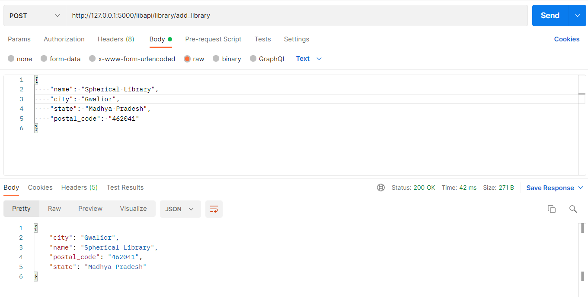

### 4. Add user (/libapi/users/add_user)
Add new users who will use the library services
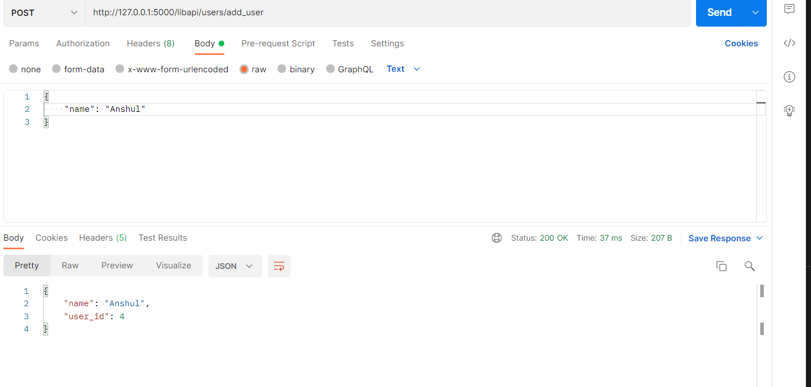

### 5. Add book to a specific library (/libapi/library/add_book)
Add books from inventroy to specific libraries. last_library_activity_id is defaulted to 0 and new library_book_id is assigned.
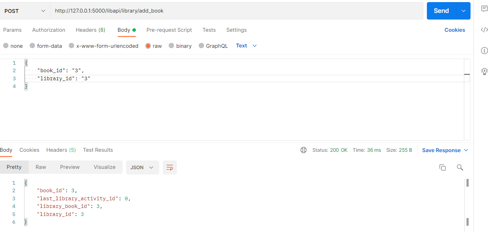

### 6. Checkout books (/libapi/book/checkout_book)
User can checkout a book using the library_book_id. *The output currently will show null as a response and not as shown as in the screenshot*
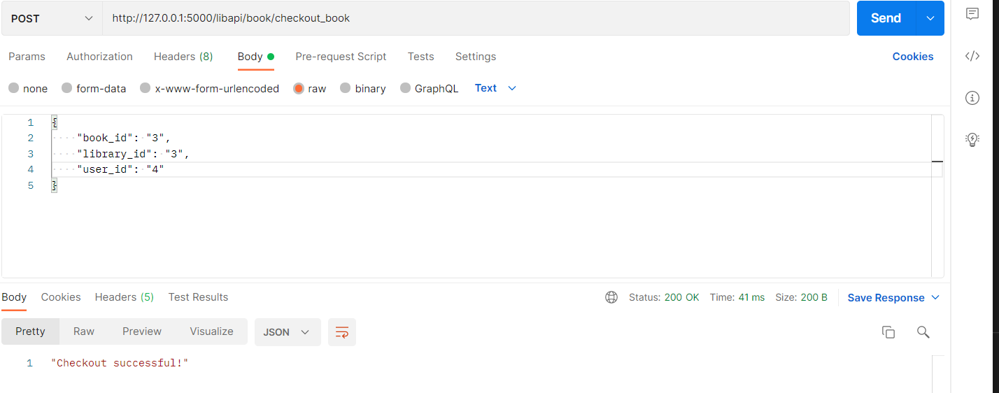

in the backend it looks like the below, please see the last line. The first activity will always be a checkout and the checkin time would be defaulted to Jan 1 1900. This will be milestoned and the checkin date will be updated alongwith the activity type as checkin.
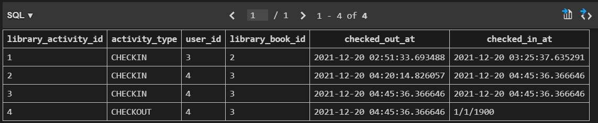

In case if someone tries to checkout an already checked out book.
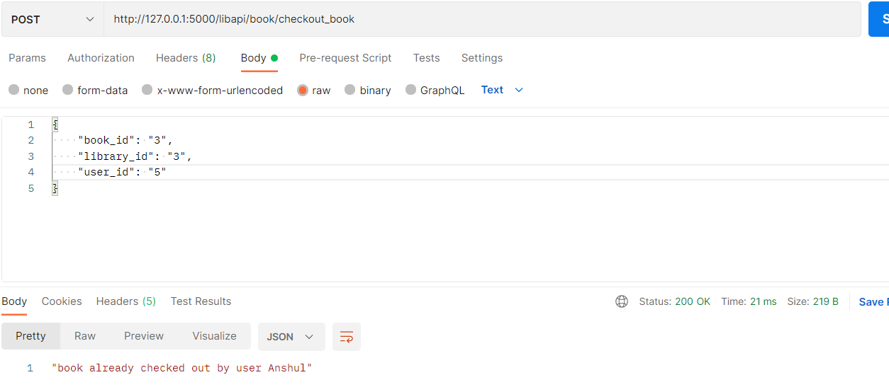

### 7. Checkin books (/libapi/book/checkin_book)
User can checkin a book using the library_book_id. *The output currently will show null as a response and not as shown as in the screenshot*
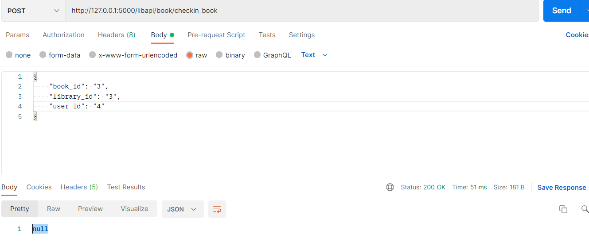

in the backend it looks like the below, please see the last line. This last row is now milestoned and the checkin date is updated alongwith the activity type as checkin.
a fresh checkout on the same library_book_id will create a new open checout row which will be milestoned upon checkin of the same book.
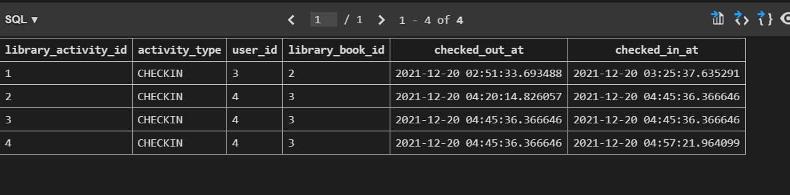

In case if someone else tries to checkin.
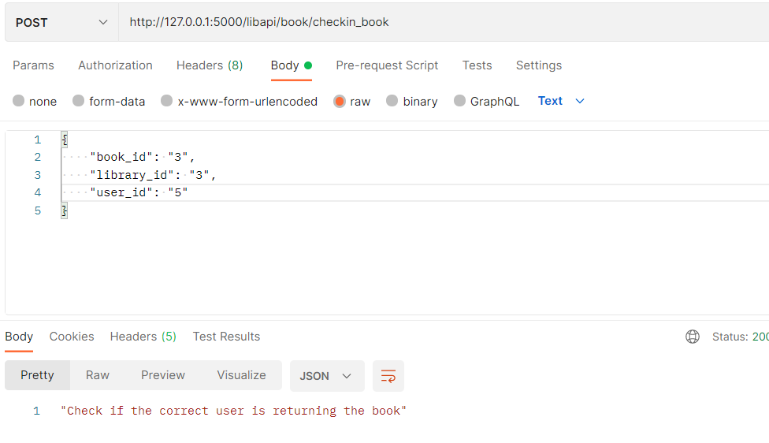

Database table snapshots:

libraries
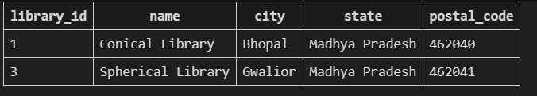

books
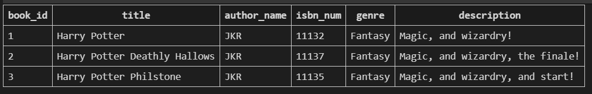

library_activity

library_book
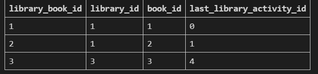

user
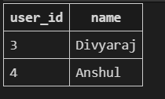

## Testing, wasn't able to create pytest scripts due to time constraints , had created one fixture.

## Improvements:
1. Usage of SQLAlchemy for the database interactions, more control, more versatility and ease of formatting.
2. Appending JWT headers to the JSON payloads being sent to the REST API for authentication.

## Product owner questions:
1. Better visibility on the data volume to tune the throughput accordingly. How many libraries, how many users expected/footfall.
2. Introduction of some fields to better identify users in the database just other than the names.
3. Introduction of another column in database to store the number of copies of each book, currently keeping count is tedious as per the current schema.
4. Any vision of online rent and dispatch of library books, need to plan for another module (COVID era).
